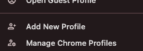
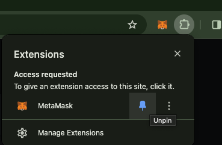
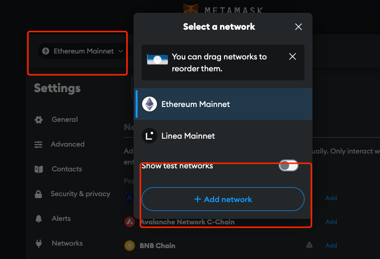
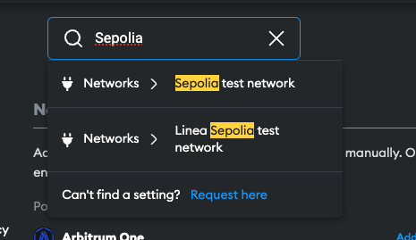
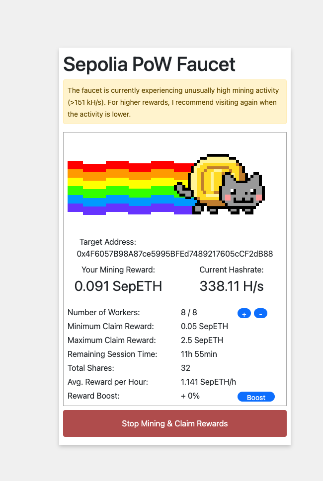
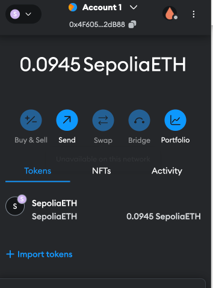

# 环境准备
 
这是我的第一次关于wargame的记录，我想还是要记录一下我是如何准备我的环境的。
目前感觉大概是需要：

- Chrome
- MetaMask

最开始的时候，我认为我是不需要使用 [harhat](https://hardhat.org/)  活着 [foundry](https://github.com/foundry-rs/foundry)，所以我先用浏览器就好了。

首先，为了环境的干净，在chrome中创建一个新的profile。

然后安装 [MetaMask](https://chromewebstore.google.com/detail/metamask/nkbihfbeogaeaoehlefnkodbefgpgknn?hl=en-US&utm_source=ext_sidebar).

安装之后，需要添加一个测试网络

添加Sepolia:

然后切换到这里就好。

剩下的就是搞点ETH，我是直接用 
挖一会，之后提现就好。

好了，现在要开始做题了。

[ethernaut](https://ethernaut.openzeppelin.com/) gogogo!